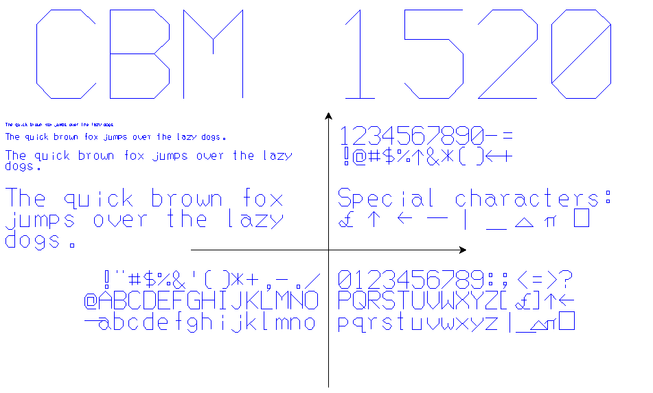
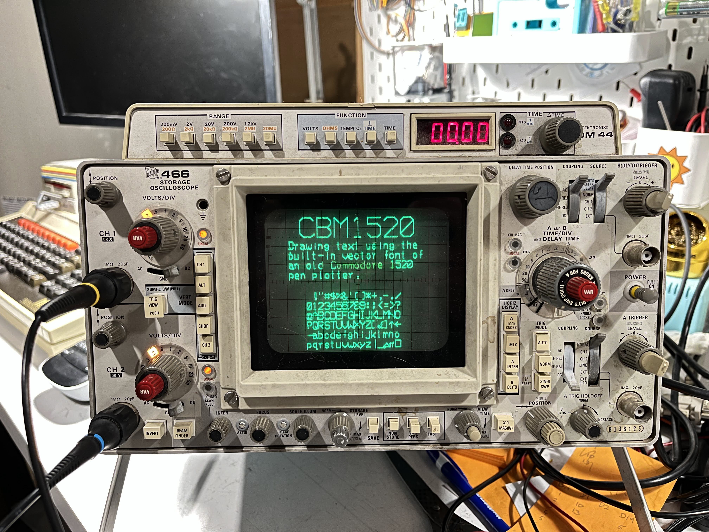

# Commodore 1520 Plotter Font

The Commodore 1520 plotter (VC-1520 in some markets) is a small, 4-colour pen
plotter that was sold as an accessory to the Commodore 64 home computer. As well
as basic line-drawing, it could print text in four different size using a
built-in vector font.

Some clever C64-scene members [dumped the
firmware](https://e4aws.silverdr.com/hacks/6500_1/) of the 1520 and
[reverse-engineered
it](https://github.com/Project-64/reloaded/blob/master/1520/rom/325340-03.s),
exposing for the first time the raw font data and control logic. Commodore's
engineers managed to fit the entire firmware into 2 kilobytes of ROM - of which
660 bytes are used by the font data.

This project contains basic tools to extract the font data from a 1520 firmware
image, and export it into more useful formats.



## Files

### Source

* `source/325340-03.bin`: Firmware image (from
  https://github.com/Project-64/reloaded/blob/master/1520/rom/325340-03.bin)

### Scripts

* `scripts/extract1520.py`: Extracts font data from the firmware image and
  converts it into a JSON representation

* `scripts/json2hershey.py`: Converts JSON font data (from `extract1520.py`)
  into the [Hershey Fonts](http://paulbourke.net/dataformats/hershey/) ASCII
  'JHF' format, suitable for use with the Python
  [HersheyFonts](https://github.com/apshu/HersheyFonts) module.

* `scripts/fonttest.py`: Uses the Python
  [HersheyFonts](https://github.com/apshu/HersheyFonts) module to render a
  simple font demonstration.

### Font Data

* `cbm1520.bin`: Binary font data as represented in ROM

* `cbm1520.json`: JSON dictionary mapping characters onto lists of vertices.

* `cbm1520.jhf`: [Hershey Fonts](http://paulbourke.net/dataformats/hershey/)
  ASCII 'JHF' data (includes non-standard font-metrics header for use with
  [HersheyFonts](https://github.com/apshu/HersheyFonts) Python module).

## Character Set

As is typical for Commodore devices, the 1520's character set is somewhat
idiosyncratic. It is *mostly* ASCII, but with a few variations:

| Codepoint | ASCII Symbol | 1520 Symbol | Description              |
|-----------|--------------|-------------|--------------------------|
| 0x5C      | \            | £           | Pound currency symbol    |
| 0x5E      | ^            | ↑           | Up Arrow                 |
| 0x5F      | _            | ←           | Left Arrow               |
| 0x60      | `            | —           | Em Dash                  |
| 0x7B      | {            | \|          | Vertical Bar             |
| 0x7C      | \|           | _           | Underscore               |
| 0x7D      | }            | △           | Upward Pointing Triangle |
| 0x7E      | ~            | π           | Greek letter Pi          |
| 0x7F      | DEL          | □           | Square Box               |

Note that uppercase and lowercase are NOT switched as they are in PETSCII.

## File Formats

### Binary

In the ROM, the font data is 660 bytes long, starting at byte 1 (NOT byte 0).
`cbm1520.bin` contains the extracted font data only.

The binary format of the font data in ROM is ingeniously packed into a single
byte per vertex. Vertex data is stored as a stream in codepoint order, starting
at 0x20 (space), with a flag bit marking boundaries between codepoints.

Each byte is divided into bit fields as follows:

| 7 (MSB) | 6  | 5  | 4  | 3  | 2  | 1  | 0 (LSB) |
|---------|----|----|----|----|----|----|---------|
| last    | X2 | X1 | X0 | Y2 | Y1 | Y0 | draw    |

Note how the `last` and `draw` bits are arranged so that they can both be tested
in a single 6502 `BIT` instruction, which sets the Negative and Carry flags to
the value of the most- and least-significant bit, respectively.

| Field  | Description                                             |
|--------|---------------------------------------------------------|
| last   | 1 if this is the last vertex for the character          |
| X2..X0 | X coordinate (0-8, origin at left)                      |
| Y2..Y0 | Y coordinate (0-8, origin at bottom)                    |
| draw   | 1 if a line should be drawn while moving to this vertex |

The first vertex of each character always has the `draw` bit set to 0, and sets
the starting position for the character.

In the 1520's implementation, there is no table of pointers to each codepoint -
the full vertex list is scanned every time, counting the number of vertices with
the `last` bit set, until the desired codepoint is reached.

### JSON Format

If you're looking to use the 1520 font in your own projects, the JSON data is
probably what you want.

The JSON representation is a simple dictionary, mapping from characters onto
lists of vertex data, as in the binary representation described above.

For example, the `+` character is shown below:

```json
    "+": [
        {
            "x": 2,
            "y": 2,
            "draw": false
        },
        {
            "x": 2,
            "y": 6,
            "draw": true
        },
        {
            "x": 0,
            "y": 4,
            "draw": false
        },
        {
            "x": 4,
            "y": 4,
            "draw": true
        }
    ],
```

### Hershey Format

The [Hershey Fonts](http://paulbourke.net/dataformats/hershey/) are a collection
of permissively-licensed vector fonts, designed to be rendered on plotters and
vector CRTs. These fonts are commonly distributed in an ASCII-based format with
the file extension `.JHF`, and due to their permissive licensing, are reasonably
ubiquitous in vector-graphics applications. A full description of the JHF file
format is available at the link above.

`cbm1520.jhf` contains a JHF description of the 1520 font, suitable for use in
applications that understand Hershey fonts, or with the
[HersheyFonts](https://github.com/apshu/HersheyFonts) Python module. A
non-standard header line is included, providing font metrics information - this
may need to be deleted in order for the file to be correctly parsed by some
applications.

The 1520 font uses Hershey glyph numbers that map directly to the corresponding
ASCII/UTF-8 glyphs; this may clash with existing Hershey glyphs, but provides a
convenient mapping.

## Font Metrics

The 1520 font is monospace; while some special characters use the full 8x8
coordinate space, most characters and digits are 5 units wide (starting at X
position 0). The baseline is at Y position 1, descenders extend to Y position 0.

## Usage Example

### CBM 1520 font rendered on an oscilloscope X-Y display



## License

The copyright status of old Commodore IP is as murky as ever. Probably don't use
this commercially.

## TODO

[ ] More output formats

[x] Map non-ASCII characters to appropriate Unicode codepoints (possible with
    `extract1520.py --remap` option but does not appear to be supported by
    HersheyFonts)

[ ] 'True ASCII' version with nonstandard characters replaced by standard ASCII
    glyphs.

[ ] Dig out my real C64 and 1520 and take some example pictures and confirm font
    metrics.

## See Also

* [Details on how firmware was extracted](https://e4aws.silverdr.com/hacks/6500_1/)

* [Disassembly of 1520 firmware](https://github.com/Project-64/reloaded/blob/master/1520/rom/325340-03.s)

* [Outline-font versions of 1520 fonts](https://scruss.com/blog/2016/04/23/fifteentwenty-commodore-1520-plotter-font/)

* [More info on Hershey fonts](http://paulbourke.net/dataformats/hershey/)
